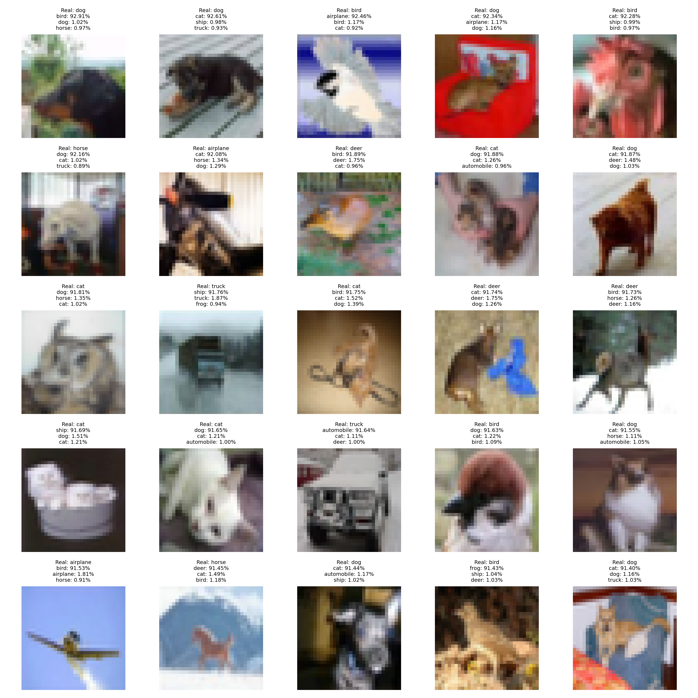

# CIFAR-10 Image Classification with ResNet-18

Small computer vision project using PyTorch and CIFAR-10.

The project started with a simple CNN and was improved step by step to a tuned ResNet-18 model with regularization, data augmentation, MixUp training, SGD/Nesterov optimization, evaluation tools, visualization, single-image prediction, and a local Gradio demo.

## Final Result

Best model:

* Architecture: ResNet-18
* Dataset: CIFAR-10
* Optimizer: SGD
* Momentum: `0.9`
* Nesterov: `true`
* Scheduler: CosineAnnealingLR
* Loss: CrossEntropyLoss with `label_smoothing=0.1`
* Augmentation:

  * RandomCrop
  * RandomHorizontalFlip
  * RandomErasing
* Epochs: `100`
* Best test accuracy: **95.49%**
* Errors: **451 / 10000**

## Dataset

The project uses the CIFAR-10 dataset.

CIFAR-10 contains 60,000 color images:

* 50,000 training images
* 10,000 test images
* 10 classes
* Image size: 32x32 pixels

Classes:

* airplane
* automobile
* bird
* cat
* deer
* dog
* frog
* horse
* ship
* truck

## Results

| Model                                                        | Test Accuracy |
| ------------------------------------------------------------ | ------------: |
| Simple CNN                                                   |        87.07% |
| ResNet-18                                                    |        92.92% |
| ResNet-18 + Label Smoothing                                  |        93.28% |
| ResNet-18 + Label Smoothing + RandomErasing                  |        93.56% |
| ResNet-18 + Label Smoothing + RandomErasing + MixUp          |        93.75% |
| ResNet-18 + SGD + Nesterov + Label Smoothing + RandomErasing |    **95.49%** |

## Per-Class Accuracy

| Class      | Accuracy |
| ---------- | -------: |
| airplane   |   95.10% |
| automobile |   98.50% |
| bird       |   94.10% |
| cat        |   91.30% |
| deer       |   96.60% |
| dog        |   92.40% |
| frog       |   96.50% |
| horse      |   97.10% |
| ship       |   97.40% |
| truck      |   95.90% |

The weakest classes are still visually similar animal classes, especially `cat` and `dog`, but the SGD/Nesterov training recipe significantly improved these classes compared to the previous MixUp model.

## Most Common Errors

| Real Class | Predicted Class | Count |
| ---------- | --------------- | ----: |
| cat        | dog             |    53 |
| dog        | cat             |    50 |
| truck      | automobile      |    25 |
| airplane   | ship            |    17 |
| frog       | cat             |    16 |
| bird       | dog             |    14 |
| airplane   | bird            |    14 |
| ship       | airplane        |    13 |
| automobile | truck           |    13 |
| deer       | cat             |    12 |
| bird       | frog            |    12 |
| bird       | deer            |    12 |
| frog       | bird            |    10 |
| horse      | dog             |     9 |
| dog        | deer            |     9 |

## Confusion Matrix

Confusion matrix by count:


Confusion matrix by percentage:


## Most Confident Mistakes

The model was also tested on its most confident wrong predictions.



This helps show where the model is confidently wrong and which classes are still difficult to separate.

## Project Structure

```text
cifar10-resnet18-pytorch/
├── README.md
├── requirements.txt
├── train.py
├── evaluate.py
├── visualize_mistakes.py
├── predict.py
├── export_samples.py
├── demo.py
├── src/
│   ├── __init__.py
│   ├── config.py
│   ├── data.py
│   ├── model.py
│   └── utils.py
├── images/
│   ├── cifar_resnet_mistakes.png
│   ├── cifar_resnet_mixup_mistakes.png
│   ├── cifar_resnet_sgd100_mistakes.png
│   ├── confusion_resnet_counts.png
│   └── confusion_resnet_percent.png
├── samples/
│   ├── airplane.png
│   ├── automobile.png
│   ├── bird.png
│   ├── cat.png
│   ├── deer.png
│   ├── dog.png
│   ├── frog.png
│   ├── horse.png
│   ├── ship.png
│   └── truck.png
└── .gitignore
```

## Model Weights

Model weights are stored separately and are not included in this repository.

Best model file:

```text
cifar_resnet18_sgd100_best.pth
```

Previous best model files:

```text
cifar_resnet18_mixup_best.pth
cifar_resnet18_smooth_erasing_best.pth
```

Model weights link:

```text
https://drive.google.com/file/d/13ETZ2NhCuk5G91QQXIARWGrFjT1CcGMM/view?usp=drive_link
```

Locally, the best model checkpoint should be placed here:

```text
models/cifar_resnet18_sgd100_best.pth
```

The `models/` directory is ignored by Git.

## Installation

Install dependencies:

```bash
pip install -r requirements.txt
```

Or install manually:

```bash
pip install torch torchvision matplotlib numpy pillow gradio
```

## Scripts

### Train

Train the model with default settings:

```bash
python3 train.py
```

Train the current best SGD/Nesterov model:

```bash
python3 train.py \
  --epochs 100 \
  --optimizer sgd \
  --lr 0.1 \
  --momentum 0.9 \
  --nesterov \
  --weight-decay 5e-4 \
  --label-smoothing 0.1 \
  --model-name cifar_resnet18_sgd100_best.pth
```

Train the previous MixUp model:

```bash
python3 train.py \
  --epochs 40 \
  --mixup-alpha 0.2 \
  --model-name cifar_resnet18_mixup_best.pth
```

Train with AdamW:

```bash
python3 train.py \
  --epochs 40 \
  --optimizer adamw \
  --lr 0.001 \
  --weight-decay 5e-4
```

Train with a custom batch size:

```bash
python3 train.py --epochs 40 --batch-size 128
```

Disable RandomErasing:

```bash
python3 train.py --no-random-erasing
```

Save checkpoint with a custom name:

```bash
python3 train.py --model-name custom_model.pth
```

### Evaluate

Evaluate the best SGD/Nesterov model:

```bash
python3 evaluate.py --model-path models/cifar_resnet18_sgd100_best.pth
```

Evaluate the default model from `src/config.py`:

```bash
python3 evaluate.py
```

This script prints:

* total accuracy
* number of errors
* per-class accuracy
* most common classification errors

It also saves confusion matrix images to the `images/` directory.

### Visualize Mistakes

Generate an image grid with the most confident wrong predictions:

```bash
python3 visualize_mistakes.py --model-path models/cifar_resnet18_sgd100_best.pth
```

Save SGD100 mistakes visualization with a custom output name:

```bash
python3 visualize_mistakes.py \
  --model-path models/cifar_resnet18_sgd100_best.pth \
  --output cifar_resnet_sgd100_mistakes.png
```

Change the number of shown mistakes:

```bash
python3 visualize_mistakes.py --limit 25
```

### Predict One Image

Run prediction on a single image:

```bash
python3 predict.py --image samples/cat.png
```

Run prediction with the best SGD/Nesterov checkpoint:

```bash
python3 predict.py \
  --image samples/cat.png \
  --model-path models/cifar_resnet18_sgd100_best.pth
```

Run prediction on a custom image:

```bash
python3 predict.py --image "/path/to/image.jpg"
```

Show top-5 predictions:

```bash
python3 predict.py --image samples/cat.png --top-k 5
```

### Export CIFAR-10 Samples

Export one sample image for each CIFAR-10 class:

```bash
python3 export_samples.py
```

Output directory:

```text
samples/
```

### Gradio Demo

Run local Gradio demo:

```bash
python3 demo.py
```

Default local URL:

```text
http://127.0.0.1:7860
```

The demo opens a local web interface where you can upload an image and get top-3 CIFAR-10 predictions.

## Sample Predictions

Example predictions from exported CIFAR-10 samples:

```text
cat.png        -> cat: 91.40%
airplane.png   -> airplane: 91.09%
automobile.png -> automobile: 90.30%
dog.png        -> dog: 93.32%
```

Example prediction on a real cat image:

```text
cat: 92.22%
bird: 0.99%
horse: 0.96%
```

## Training Setup

Training was done on Apple Silicon using PyTorch MPS acceleration.

Device used:

```text
mps
```

Main training settings for the best model:

```text
Epochs: 100
Optimizer: SGD
Learning rate: 0.1
Momentum: 0.9
Nesterov: true
Weight decay: 5e-4
Scheduler: CosineAnnealingLR
Loss: CrossEntropyLoss(label_smoothing=0.1)
RandomErasing: enabled
Best checkpoint selection: by test accuracy
```

## Notes

Switching from AdamW to SGD with momentum and Nesterov acceleration improved the final model from **93.75%** to **95.49%**.

The most difficult classes were animals with similar visual features, especially:

* cat vs dog
* bird vs deer
* bird vs frog

The final model performs well overall, with most errors happening between visually similar classes rather than random incorrect predictions.

The model was trained on CIFAR-10 images with a resolution of 32x32 pixels, so predictions on real high-resolution images may be less reliable than predictions on CIFAR-like images.

## Releases

Current release:

```text
v1.3.0
```

Release highlights:

* added optimizer selection to `train.py`
* added SGD/Nesterov training support
* improved best accuracy to **95.49%**
* reduced errors from **625** to **451**
* updated confusion matrix images
* added SGD100 confident mistakes visualization
* updated README and best model reference

Previous release:

```text
v1.2.0
```

Release highlights:

* added MixUp training support
* improved best accuracy to **93.75%**
* added MixUp confident mistakes visualization
* updated README with MixUp results

## Future Improvements

Possible next experiments:

* SGD + Nesterov for 200 epochs
* target 96% test accuracy
* CutMix
* MixUp with SGD
* ResNet-34
* WideResNet
* stronger augmentation
* learning rate tuning
* model calibration analysis
* Hugging Face Model repository
* Hugging Face Space demo
